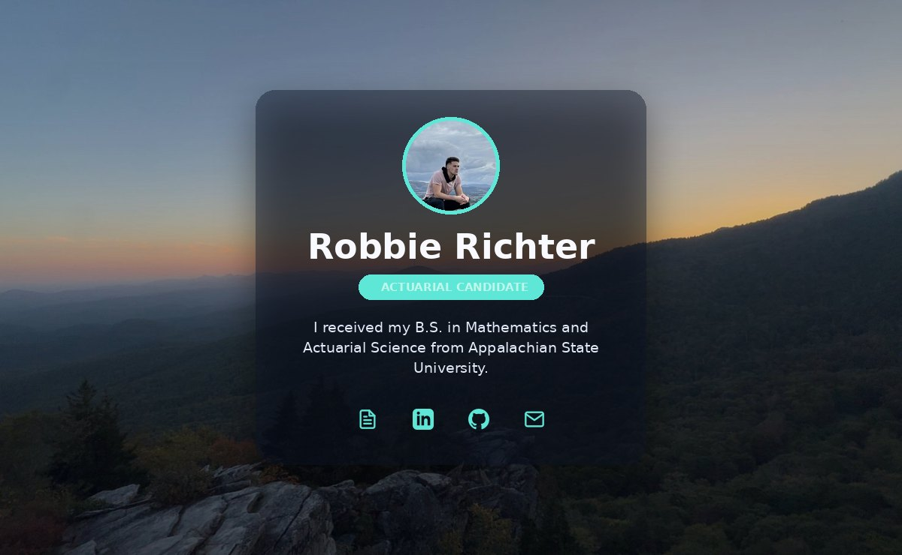

# Robbie Richter — Personal Website

My personal landing page: a single, fast-loading page with my résumé, LinkedIn, GitHub, and email — set against a Blue Ridge Mountains sunset. 🏔️

🔗 **Live:** https://richterrw.github.io/robbie-portfolio/



---

## About

I'm Robbie Richter, an Actuarial Candidate with a B.S. in Mathematics and Actuarial Science from Appalachian State University. This site is a clean, modern hub that points recruiters and collaborators to everything in one place.

## Features

- 🌄 **Full-bleed photo background** — a real Blue Ridge sunset with a subtle slow zoom
- 🪟 **Floating glass card** — frosted, translucent, gently animated
- 🙂 **Profile headshot** in a spinning teal gradient ring
- 🔗 **Quick links** — Résumé (PDF), LinkedIn, GitHub, and Email as clean icon buttons
- ✨ **Polished motion** — shimmering name, fade-in entrance, hover effects
- ♿ **Accessible** — screen-reader labels and full `prefers-reduced-motion` support
- 📱 **Responsive** — looks great on desktop and mobile
- ⚡ **Zero dependencies** — plain HTML, CSS, and a touch of JavaScript

## Tech Stack

- **HTML5** + **CSS3** (custom properties, backdrop-filter, keyframe animations)
- **Vanilla JavaScript** (no frameworks, no build step)
- **GitHub Pages** for hosting

## Project Structure

```
robbie-portfolio/
├── index.html      # Page markup
├── styles.css      # Styling and animations
├── background.jpg  # Blue Ridge sunset background
├── me.jpg          # Profile headshot
├── resume.pdf      # Résumé (linked from the Résumé button)
├── preview.jpg     # Screenshot used in this README
└── .nojekyll       # Serve files as-is (no Jekyll processing)
```

## Run Locally

Clone the repo and open `index.html` in your browser, or serve it locally:

```bash
git clone https://github.com/richterrw/robbie-portfolio.git
cd robbie-portfolio
python3 -m http.server 8000
# then visit http://localhost:8000
```

## Deployment

Hosted on **GitHub Pages** (deploy from `main`):

1. **Settings → Pages**
2. **Source:** *Deploy from a branch*
3. **Branch:** `main` · folder `/ (root)` → **Save**

Every push to `main` republishes the site automatically.

## Customization

- **Links:** edit the `href`s in `index.html` (LinkedIn, GitHub, email)
- **Résumé:** replace `resume.pdf`
- **Photo / background:** swap `me.jpg` and `background.jpg`
- **Colors:** tweak the CSS custom properties at the top of `styles.css`

## Contact

- **LinkedIn:** https://www.linkedin.com/in/robert---richter
- **GitHub:** https://github.com/richterrw
- **Email:** robbierichter15@gmail.com
